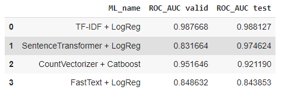
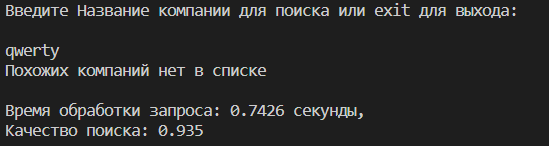

**Данный репозиторий содержит материалы для решения учебной задачи**

**Задача:**

Необходимо разработать модель, которая будет "сравнивать" названия компаний среди двух столбцов таблицы, и выдавать являются ли они "дублями". Также на базе лучшей модели реализовать "поисковый движок" по данному датасету.

**Решение:**

**1.** В папке `experiments` находится [ноутбук](./experiments/DL-case2_v2.1.ipynb) с различными моделями классификации и методами для формирования векторного представления текстовых данных. Было принято решение сравнивать модели по метрике ROC-AUC. Она отлично подходит под задачу классификации. 

Весь датасет был разделен на трейн/вал/тест части в соотношении 80%, 10%, 10%

**Шаги реализации экспериментов:**

* приведение датасета к одному языку (впоследствии отказались ввиду трудозатратности)
* очистка датасета от наименований стран и континентов
* очистка датасета от видов собственности компаний (Llc., Ltd, ООО и т.п.)
* векторизация строк различными методами
* обучение моделей классификации
* выбор лучшей результата
* реализация поисковго движка на основе расстояния между векторами

Результаты эксперимиентов можно видеть ниже в таблице.

В качестве основого метода выбрали `TF-IDF + LogReg`, так как он показал лучшие значения метрики и был одним из самых быстрых по скорости обработки. Реализовать поиск дубликатов в таблице решено с помощью предсказания модели, иначе для чего мы ее обучали ? =)

---

**2.** Для реализации поискового "движка" было написано три файла:

* [pipe.py](./pipe.py) - пайплайн очистики датасета + вводимой фразы
* [train.py](./train.py) - обучение модели на очищенном датасете
* [rank.py](./rank.py) - непосредсвенно сам поиск введенного названия компании и вывод топ-5 похожих. Так же реализован замер скорости обработки запроса по поиску дубля компании в датасете. Замер скорости производился на CPU - 12th Gen Intel(R) Core(TM) i5-1240P

---

**3.** Для запуска необходимо:

Сделать это и это

---

**4.** Результат работы:

